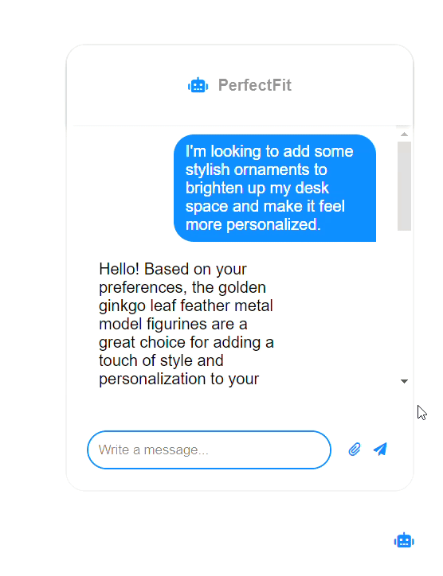
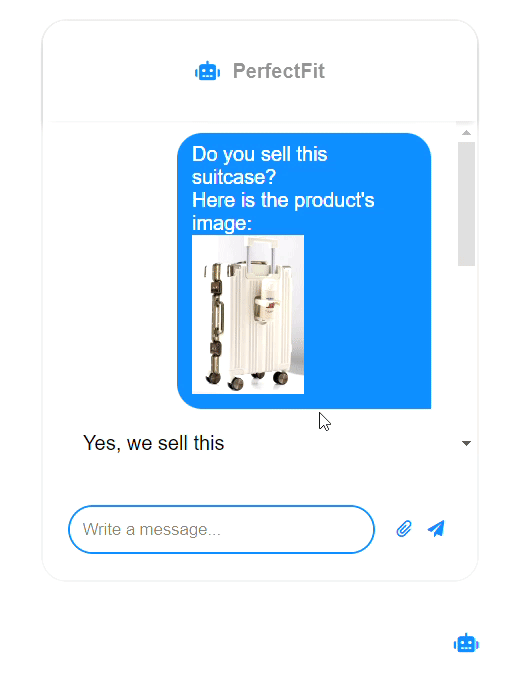
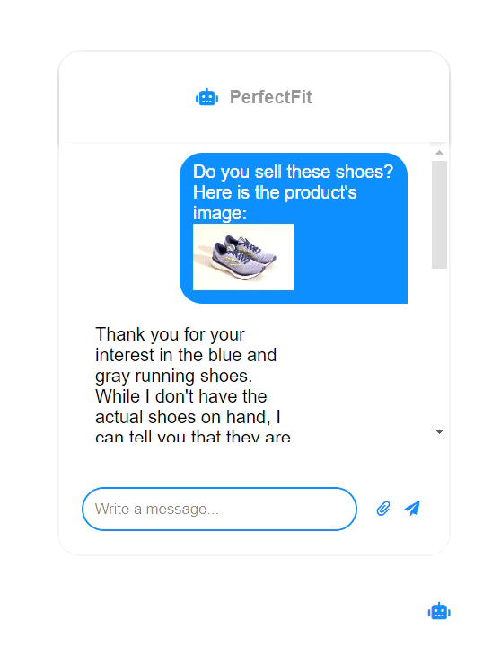

# PerfectFit

We present to you – PerfectFit, your AI shopping assistant for online buying experience. If you've ever found yourself feeling overwhelmed by the endless product options on e-commerce sites, or unsure if a specific product exists, PerfectFit is here to make your shopping experience simpler, faster, and more intuitive.

## 🎯 What is PerfectFit?
Using your description and/or an image of what you are searching for, PerfectFit asks you several questions before using its AI-assisted intelligent swatch chooser to find the suitable product in seconds. Say goodbye to the tedious scrolling or guesswork — PerfectFit instantly finds your requirements and quickly aligns them with the best recommendations for all the things you want, ensuring you are always matched stripe for stripe with what you seek. Multimodal by design, PerfectFit provides a seamless experience of text-based product search and visual search.

## 🚀 Key Features & Benefits
- Find Your Fit with Ease: Describe what you need, and PerfectFit’s AI will recommend the ideal products – no matter how unique your request might be.
- Visual Search: Got an image of what you’re after? Upload it, and PerfectFit will locate the closest matches from the available products, saving you time and effort.

## 🛠️ Technical Details
- LLaVA: Uses LLaVA to generate text summaries from images. These summaries are embedded and stored alongside references to the raw images.
- CLIP: Employs CLIP for embedding images and text into the vector space. The embeddings are stored in Qdrant, a high-performance vector database. A multi-vector retriever is used to retrieve relevant image-text pairs based on user queries.
- Gemini API: Integrates the Gemini API to automatically generate captions for user-uploaded images, enhancing multimodal interaction and improving the user experience.
- SmolLM-Instruct: Uses SmolLM-Instruct, a small language model, to generate human-like replies to user queries.

## 🎥 Demo

### Watch how **PerfectFit** works through these demos:

| **Demo 1: Text-based Search** | **Demo 2: Hybrid search (Product Exists)** | **Demo 3: Hybrid Search (Product Doesn't Exist)** |
|:-----------------------------:|:-------------------------:|:----------------------------:|
|   |  |  |


## 🌐 Getting Started
For running the project, follow these steps:

**Clone the repo** :
```bash
git clone https://github.com/imane0x/PerfectFit.git
```
**Install dependencies** :
```bash
pip install -r requirements.txt
```
**Run the Application:**
```bash
flask run
```
